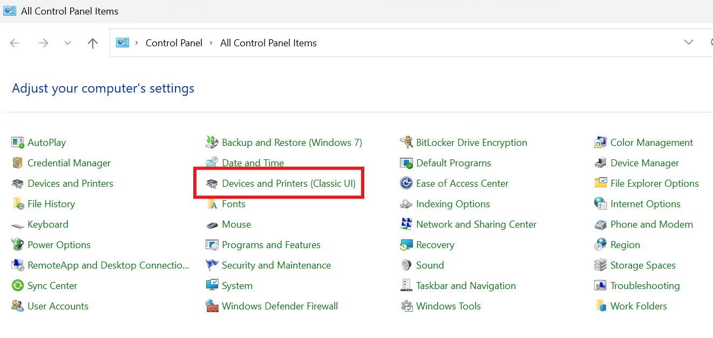
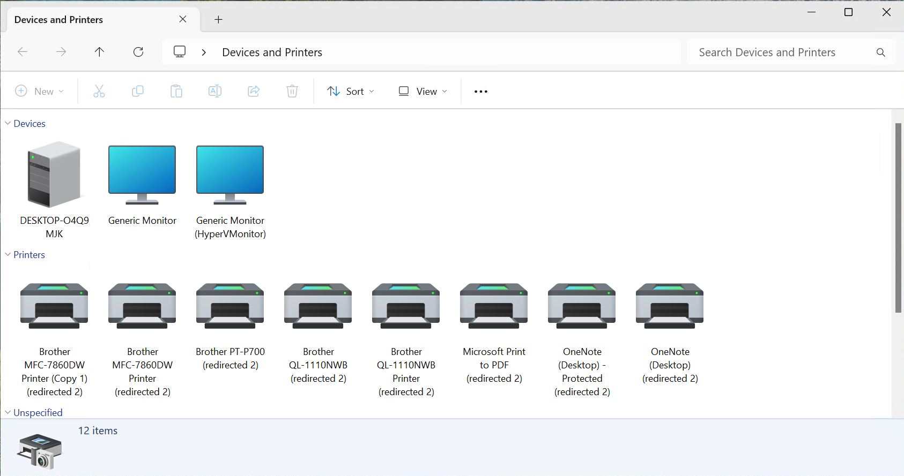

# Control Panel - Devices and Printers Classic UI

Don't you just hate that Microsoft changed the Control Panel icon that goes to Devices and Printers to now go to Settings. 

This repo will create a new Control Panel icon that reverts back to the Classic UI.

## Instructions

In the repo, find the latest release and download the `devices-and-printers-classic-cpl.reg` file

Launch it and check the `Control Panel`
