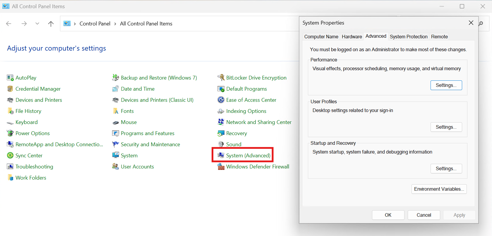

# Control Panel System Advanced

!!! github "View Repository on GitHub"
    [Control Panel System Advanced](https://github.com/ConglomoUS/Control_Panel_System_Advanced) — Check out the Repository on GitHub for the Latest Download.

This repo will create a new Control Panel icon that adds the System Properties window.

## Instructions

In the repo, find the latest release and download the `system-advanced-cpl.reg` file

Launch it and check the `Control Panel`