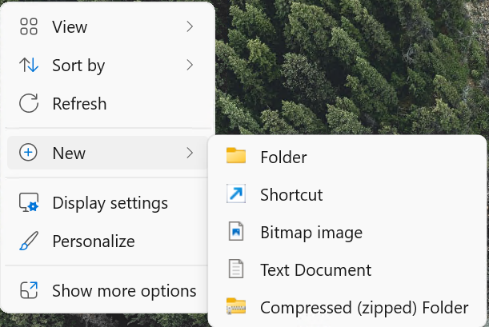
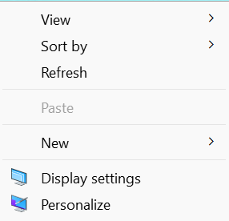
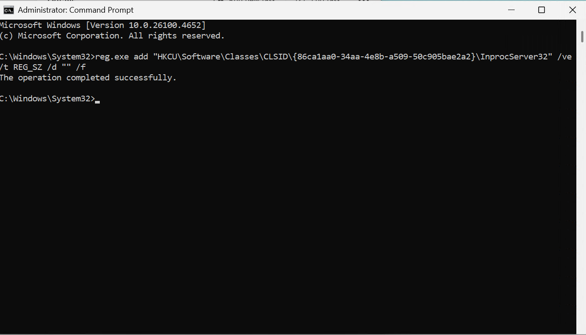

# Windows Classic Context Menu Restoration

!!! github "View Repository on GitHub"
    [Right Click Context Menu](https://github.com/ConglomoUS/Right_Click_Context_Menu) — Check out the Repository on GitHub for the Latest Download.

## Overview

This repository provides registry modifications to restore the classic Windows context menu, replacing the modern Windows 11 context menu interface.

**Before:**  


**After:**  


## Prerequisites

- Windows 11 operating system
- Administrative privileges
- Command Prompt or PowerShell access

## Implementation Methods

### Method 1: Current User Account

This method applies the classic context menu to the currently logged-in user account only.

1. Open Command Prompt as Administrator
2. Execute the following registry command:

```cmd
reg.exe add "HKCU\Software\Classes\CLSID\{86ca1aa0-34aa-4e8b-a509-50c905bae2a2}\InprocServer32" /ve /t REG_SZ /d "" /f
```



3. Restart Windows Explorer using one of the following methods:
   - **Task Manager Method:** Open Task Manager → Details tab → Locate `explorer.exe` → Right-click → Restart
   - **System Reboot:** Restart your computer
   - **Command Line Method:** Execute the following command:
     ```cmd
     taskkill /IM explorer.exe /F && explorer.exe
     ```

### Method 2: Default User Profile (Enterprise/IT Administration)

This method configures the classic context menu for all new user accounts created after implementation.

!!! warning "Important Considerations"
    - This modification only affects newly created user accounts
    - Existing user profiles remain unchanged
    - Best suited for fresh Windows installations or enterprise imaging
    - To modify existing users, individual registry modifications are required

#### Implementation Steps:

1. Open Command Prompt as Administrator
2. Execute the following commands sequentially:

```cmd
reg.exe load "HKU\DefaultUser" "C:\Users\Default\NTUSER.DAT"
reg.exe add "HKU\DefaultUser\Software\Microsoft\Windows\CurrentVersion\RunOnce" /v "LaunchClassicContextMenu" /t REG_SZ /d "C:\Windows\System32\FirstLogonScript\LaunchClassicContextMenu.lnk" /f
reg.exe unload "HKU\DefaultUser"
```

This process:
- Mounts the default user registry hive
- Creates a RunOnce registry entry that executes the context menu script on first logon
- Unmounts the registry hive

3. Navigate to `C:\Windows\System32`
4. If the `FirstLogonScript` folder does not exist, create it
5. Copy the `LaunchClassicContextMenu.lnk` file and `ClassicContextMenu.ps1` files into the `FirstLogonScript` folder

If you need to recreate the shortcut file:

!!! tip "Shortcut Recreation"
    You may not be allowed to create a shortcut directly in this folder. Instead, create the shortcut on the desktop first, then copy it to the `FirstLogonScript` folder.

1. Create a new shortcut with the target:
   ```
   C:\Windows\System32\WindowsPowerShell\v1.0\powershell.exe -ExecutionPolicy Bypass -File "C:\Windows\System32\FirstLogonScript\ClassicContextMenu.ps1" -WindowStyle Hidden
   ```

2. Name the shortcut: `LaunchClassicContextMenu`

3. Set the shortcut to run minimized in its properties

4. Move the shortcut to the `FirstLogonScript` folder

#### Verification:

Create a new user account and sign in to verify the classic context menu is automatically activated on first logon.

## Technical Details

The modification works by registering an empty COM server for the Windows 11 context menu handler, effectively disabling it and falling back to the legacy Windows context menu implementation.

**Registry Path:** `HKCU\Software\Classes\CLSID\{86ca1aa0-34aa-4e8b-a509-50c905bae2a2}\InprocServer32`

## Troubleshooting

- **Changes not visible:** Ensure Windows Explorer has been restarted
- **Access denied errors:** Verify Command Prompt is running with administrative privileges
- **Registry modification fails:** Check Windows version compatibility (Windows 11 required)
- **Script not executing on first logon:** Verify the RunOnce registry entry and file paths are correct
