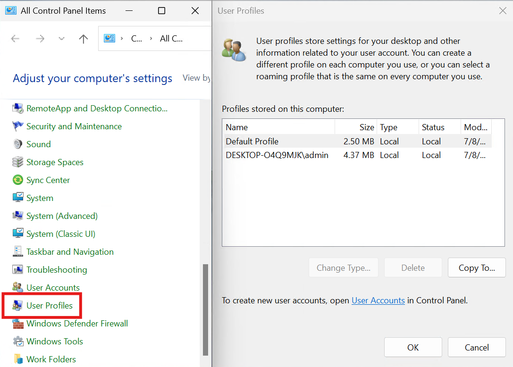

# Control Panel User Profiles

!!! github "View Repository on GitHub"
    [Control Panel User Profiles](https://github.com/ConglomoUS/Control_Panel_User_Profiles) — Check out the Repository on GitHub for the Latest Download.

This repo will create a new Control Panel icon that opens User Profiles.

## What Does the `user-profiles-cpl.reg` File Do?

The `user-profiles-cpl.reg` file adds a new entry to the Windows Registry to create a Control Panel icon for "User Profiles." Specifically, it:

1. Registers a new CLSID (`{ae7dacd9-c818-4301-887b-dbe4647fec3f}`) under `HKEY_CLASSES_ROOT` with metadata such as name, tooltip, and category.
2. Specifies the default icon for the Control Panel entry using `objsel.dll`.
3. Configures the `RunAs` command to launch the `rundll32.exe` executable with parameters to open the User Profiles dialog.
4. Adds the CLSID to the Control Panel namespace under `HKEY_LOCAL_MACHINE`.

## Instructions

### Installation

1. Download the `user-profiles-cpl.reg` file from the latest release in this repository.
2. Double-click the file to launch it. You may be prompted to confirm changes to the Windows Registry.
3. Once installed, open the Control Panel. You should see a new icon labeled "User Profiles."

### Uninstallation

To remove the Control Panel icon:

1. Open the Registry Editor (`regedit.exe`).
2. Navigate to the following keys and delete the entries:
   - `HKEY_CLASSES_ROOT\CLSID\{ae7dacd9-c818-4301-887b-dbe4647fec3f}`
   - `HKEY_LOCAL_MACHINE\SOFTWARE\Microsoft\Windows\CurrentVersion\Explorer\ControlPanel\NameSpace\{ae7dacd9-c818-4301-887b-dbe4647fec3f}`
3. Restart your computer or refresh the Control Panel to apply the changes.